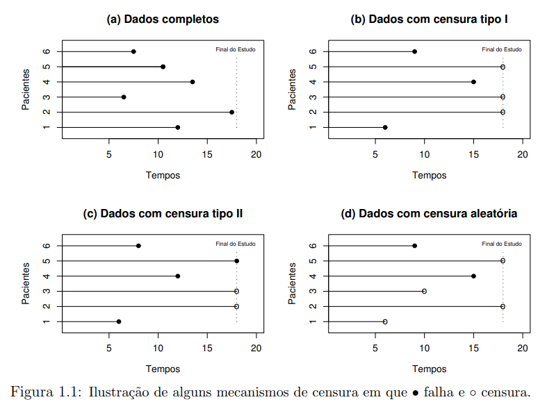
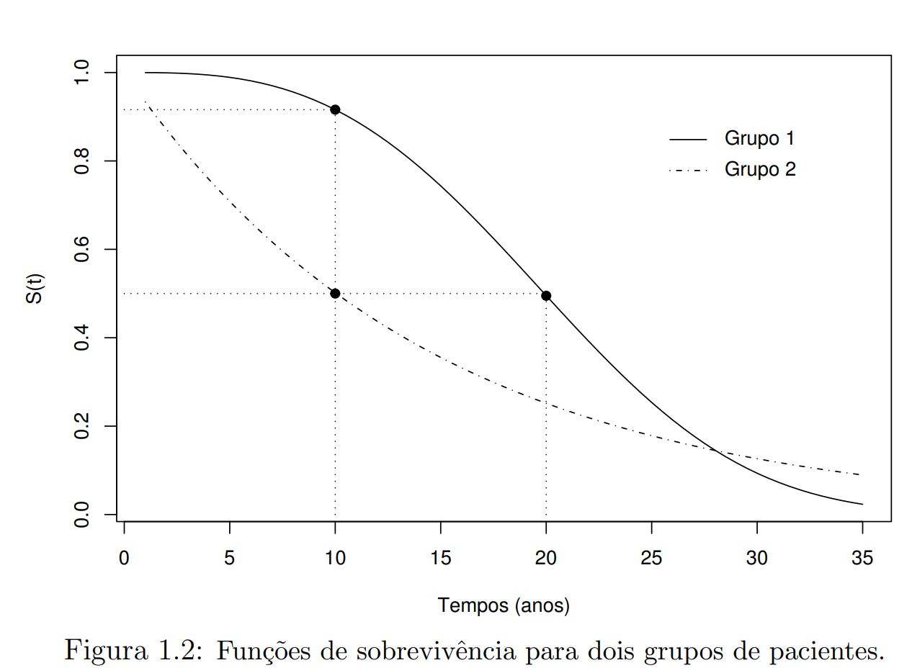
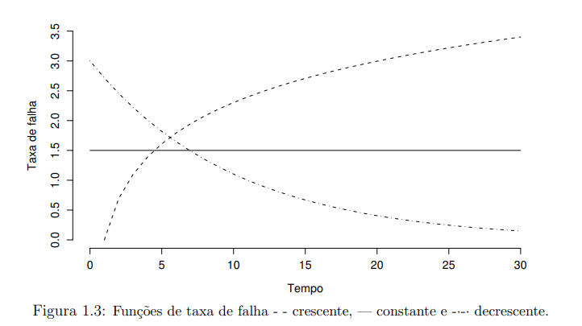
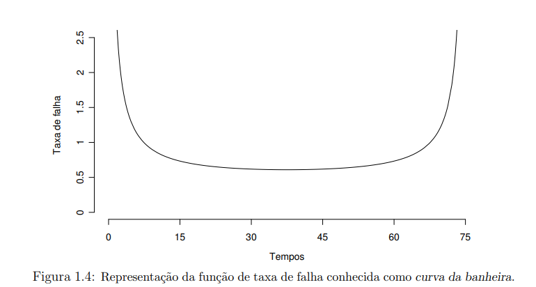

## Introdução {.smaller background="Seashell"}

::: columns
::: {.column width = "50%"}

Em análise de sobrevivência a **variável resposta** é o **tempo** até a ocorrência de um **evento de interesse**.

Principal característica de dados de sobrevivência é a **censura**, onde:

 - Há observação parcial das repostas;
 - Seja pelo interrompimento do acompanhamento do paciente;
 - Pelo término do estudo para análise;
 - Ou o paciente morreu por causa diversa da estudada.

:::

::: {.column width="50%"}

Sem **censura**, se utilizaria as técnicas estatísticas clássicas para análise destes tipos de dados, mediante a transformação para as respostas.

E havendo presença de censura, nesses casos, utiliza-se **métodos de análise de sobrevivência**, pois:

  - Possibilita incorporar na análise estatística as informações dos dados censurados.

:::
:::

## Objetivo e Planejamento dos Estudos {background="OldLace"}

Nos objetivos, o autor[@colosimo2006analise] define o que são **estudos clínicos**: investigação científica com objetivo de provar ou não uma determinada hipóteses de interesse. Em geral esses estudos são divididos em **três etapas**:

  1. Formulação da hipótese de interesse.
  2. Planejamento e coleta de dados.
  3. Análise estatística dos dados para validar ou não a hipótese formulada.

## Objetivo e Planejamento dos Estudos {background="OldLace"}

Em análise de sobrevivência a resposta é por natureza **longitudinal**. 

>  Se dá pelo acompanhamento observado ao longo do tempo. 

{.absolute .fragment top="55%" right="30%" width="45%" height="45%"}

## Objetivo e Planejamento dos Estudos {background="OldLace"}

**Formas básicas de estudos clínicos**

::: columns
::: {.column width = "50%"}

**Descritivo**: 

  - Apenas uma amostra;
  
  - Sem grupo de comparação;
  
Com o objetivo de identificar fatores de prognótico para doenças em estudo.

:::
::: {.column width = "50%"}

**Caso-controle**:

  - Compara dois grupos: caso (doentes) e controle (sudáveis);
  
  - Sofre limitação por estar sujeito a vícios. Como a escolha do grupo controle.

:::
:::

## Objetivo e Planejamento dos Estudos {background="OldLace"}

**Formas básicas de estudos clínicos**

::: columns
::: {.column width = "50%"}

**Coorte**:

  - Acompanha o tempo de exposição de dois grupos: expostos e não-expostos ao fator de interesse;
  - Avalia comparativamente os grupos  no início do estudo;
  - Podendo identificar as variáveis de interesse.
  - Desvantagem: longo e caro.

:::
::: {.column width = "50%"}

**Clínico-aleatorizado**: 

 - Experimental;
 - Existe intervenção direta do pesquisador;
 - Garante comparabilidade dos grupos.

:::
:::

## Caracterizando dados de sobrevivência {background="MintCream"}

Os conjuntos de dados de sobrevivência são caracterizados pelos **tempos de falha** e muito frequentemente pelas **censuras**. 

Estes dois constituem a **resposta.** Em estudos clínicos, um conjunto de variáveis não controladas (covariáveis) é geralmente medido em cada paciente.

## Caracterizando dados de sobrevivência {background="MintCream"}

**Tempo de Falha** 

::: columns
::: {.column width = "50%"}

**Tempo de início do estudo**: 
  
  - Deve ser definido precisamente;
  - Os indivíduos devem ser comparáveis na origem do estudo. Como data de diagnóstico ou início do tratamento de doença;
  - Com exceção de covariáveis.
  
:::
:::{.column width = "50%"}

**Escala de medida**:

  - Tempo real ou "de relógio"

**Evento de interesse (falha)**:

  - Eventos indesejáveis (falhas);
  
  - As falhas são definidas como morte, recidiva ou termos ambíguos;
  
:::
:::

## Caracterizando dados de sobrevivência {background="MintCream"}

**Evento de interesse (falha)**:

  - O evento de interesse pode ocorrer devido a uma única causa ou mais. Sendo descrito na literatura como *riscos competitivos*, em que falhas competem entre si. 

Sendo, no livro estudado, considerados as de única causa.

## Censura e Dados truncados {background="Cornsilk"}

**Censura**

Estudos clínicos que envolvem uma resposta temporal são frequentemente **prospectivos e de longa duração.**

Usualmente, estudos clínicos de sobrevivência tendem a terminar antes que todos os indivíduos no estudo venham a falhar.

Característica decorrente destes estudos é a presença de observações incompletas ou parciais, as denominadas **censuras**.

## Censura e Dados truncados {background="Cornsilk"}

**Censura** 

Todos os dados provenientes de um estudo de sobrevivência devem ser usados na análise estatística:

  1. Mesmo **incompleto**, as observações censuradas fornecem **informações** sobre **o tempo de vida do paciente**;
  2. A **omissão** das censuras no cálculo das estatísticas de interesse pode levar a **conclusões viesadas**.

## Censura e Dados truncados {background="Cornsilk"}

**Censura** 

Sendo os mecanismos de censura diferenciados em estudos clínicos e classificados como:

 - **Censura tipo I**: em que o estudo será terminado após um período pré-estabelecido de tempo;
 
 - **Censura tipo II**: em que o estudo será terminado após ter ocorrido o evento de interesse em um número prefixado de indivíduos.
 
 - **Censura tipo aleatório**: mais recorrente na prática médica. Ocorrendo quando um paciente é retirado no decorrer do estudo sem ter acontecido a falha.

## Censura e Dados truncados {background="Cornsilk"}

**Censura aleatória**: pode ser representada por duas v.a. 

T: uma v.a. representando o tempo de falha de um paciente;

C: uma v.a. independente de $T$, representando o tempo de censura associado a este paciente.

$$
t = min(T,C)
$$

$$
\delta = \begin{cases}
  1, \ T \leq \ C \\
  0, \ T > C.
\end{cases}
$$

## Censura e Dados truncados {background="Cornsilk"}

{.absolute .fragment top="15%" right="10%" width="80%" height="80%"}

## Censura e Dados truncados {background="Cornsilk"}

Tempo de falha não conhecido precisamente, pertende a um intervalo  $T_{i} \in (L_{i},U_{i}]$, denominados de *dados de sobrevivência intervalar*.

A não ocorrência do evento, nestes estudos é chamado de *censura intervalar*:

::: columns
:::{.column width = "50%"}

- $L_{i} = U_{i}$ : para tempos exatos de falha.

:::
:::{.column width = "50%"}

- $U_{i} = \infty$ :  quando o evento de interesse não acontece até o final do estudo. Sendo o tempo de falha maior que o tempo registrado. Onde ocorre a censura à direita.

:::
:::

## Censura e Dados truncados {background="Cornsilk"}

- $L_{i} = 0$ : o evento já ocorreu antes do início da observação. Sendo o tempo de falha menor que o tempo registrado. Onde ocorre a censura à esquerda.

## Censura e Dados truncados {background="Cornsilk"}

**Dados truncados**: condição que exclui certos indivíduos do estudo. Somente indivíduos que experimentaram algum evento são incluídos. 

Ex.: Pacientes diagnosticados com AIDS, a data de infecção é utilizada e o evento de interesse a ser observado é o desenvolvimento da AIDS.

## Representação de dados de Sobrevivência {background="Azure"}

Para indivíduos $i (i = 1,...,n)$ sob estudo, são representados pelo par $(t_{i}, \delta_{i})$ sendo $t_{i}$ o tempo de falha ou censura e o $\delta_{i}$ a variável indicadora de falha ou censura.

$$
\delta_{i} = \begin{cases}
	1 \ se \ t_{i} \ é \ um \ tempo \ de\  falha \\
	0 \ se \ t_{i} \ é \ um \ tempo \ censurado.
\end{cases}
$$

Na presença de covariáveis medidas no i-ésimo indivíduo tais como, dentre outras 
$x_{i}$ = (sexo, idade, tratamento recebido), os dados ficam representados por ( $t_{i}, \delta_{i},x_{i}$). 

## Representação de dados de Sobrevivência {background="Azure"}

No caso de sobrevivência intervalar, se tem, ainda, a representação ( $l_{i},t_{i},u_{i}, \delta_{i},x_{i}$) em que $l_{i} \ e\  u_{i}$ são, respectivamente, os limites inferior e superior do intervalo observado para o i-ésimo indivíduo.

## Especificando o tempo de sobrevivência {background="LightBlue"}

Uma v.a. não-negativa $T$, representa o **tempo de falha**, usualmente especificado em análise de sobrevivência pela função de sobrevivência ou pela taxa de falha.

### Função de Sobrevivência

$$
S(t) = P(T \geq t)
$$

Função definida como a probabilidade de uma observação não falhar até um certo tempo $t$, sendo a probabilidade de uma observação sobreviver no tempo $t$.

## Especificando o tempo de sobrevivência {background="LightBlue"}

{.absolute .fragment top="15%" right="10%" width="80%" height="80%"}

## Especificando o tempo de sobrevivência {background="LightBlue"}

Sendo a **função de distribuição acumulada**, dada por:

$$
F(t) = 1 - S(t)
$$

Definida como a probabilidade de uma observação não sobreviver ao tempo $t$.

### Função de taxa de falha ou de risco

A probabilidade da falha ocorrer em um intervalo de tempo, [$t_{1},t_{2}$) pode ser expresso em termos de função de sobrevivência como:
$$
S(t_{1}) - S(t_{2}) 
$$

## Especificando o tempo de sobrevivência {background="PowderBlue"}

**Taxa de falha**

A taxa de ocorrência de falha no intervalo $[t_{1},t_{2})$, definido como a probabilidade de que a falha ocorra neste intervalo, dado que não ocorra antes de $t_{1}$. Sendo expresso por:

$$
\frac{S(t_{1}) - S(t_{2})}{(t_{2} - t_{1}) \cdot S(t_{1})}
$$

## Especificando o tempo de sobrevivência {background="PowderBlue"}

Redefinindo o intervalo como $[t,t+\Delta t)$, a expressão assume a seguinte forma:

$$
\lambda(t) = \frac{S(t) - S(t+\Delta t)}{\Delta t S(t)}
$$

Assumindo $\Delta t$ bem pequeno, $\lambda(t)$ representa a taxa de falha instantânea no tempo $t$ condicional à sobrevivência até o tempo t. Sendo as taxas de falhas positivas, sem limite superior.

## Especificando o tempo de sobrevivência {background="PowderBlue"}

A função de taxa de falha de T que descreve a taxa instantânea de falha mudando com o tempo é definida como:

$$
\lambda(t) = \lim_{\Delta t \rightarrow 0} \frac{P(t \leq T < t + \Delta t \; | \; T \geq t)}{\Delta t}
$$

## Especificando o tempo de sobrevivência {background="PowderBlue"}

{.absolute .fragment top="15%" right="10%" width="80%" height="80%"}

## Especificando o tempo de sobrevivência {background="PowderBlue"}

{.absolute .fragment top="15%" right="10%" width="80%" height="80%"}

## Especificando o tempo de sobrevivência {background="PowderBlue"}

### Função de taxa de falha acumulada

Em análise de dados de sobrevivência, fornece a taxa de falha acumulada do indivíduo. Definida por:

$$
\Lambda (t) = \int_{0}^{t} \lambda(u) \; du.
$$

Não possui uma interpretação direta, mas é útil na avaliação de maior interesse que é a taxa de falha, $\lambda(t)$. Sendo na estimação não-paramétrica em que  $\Lambda(t)$ apresenta um estimador como propriedades ótimas e $\lambda(t)$ é difícil de se estimar.

## Especificando o tempo de sobrevivência {background="PowderBlue"}
 
Outras quantidades de interesse em análise de sobrevivência são: **o tempo médio de vida e a vida média residual.**

1. **Tempo médio de vida:** obtido pela área sob a função de sobrevivência:

$$
t_{m} =\int_{0}^{\infty} S(t) \; dt
$$

## Especificando o tempo de sobrevivência {background="PowderBlue"}

1. **Vida média residual:** definida pela condicional de um certo tempo de vida *t.* Ou seja, para indivíduos com idade *t*  esta quantidade mede o tempo médio restante de vida, logo, é a área sob a curva de sobrevivência à direita do tempo  *t*  dividida por $S(t)$. 

$$
vmr(t) = \frac{\int_{t}^{\infty} (u- t)f(u)du}{S(t)} =  \frac{\int_{t}^{\infty} S(u) du}{S(t)}
$$

Sendo *f(.)* a função de densidade de *T.*

## Referência

